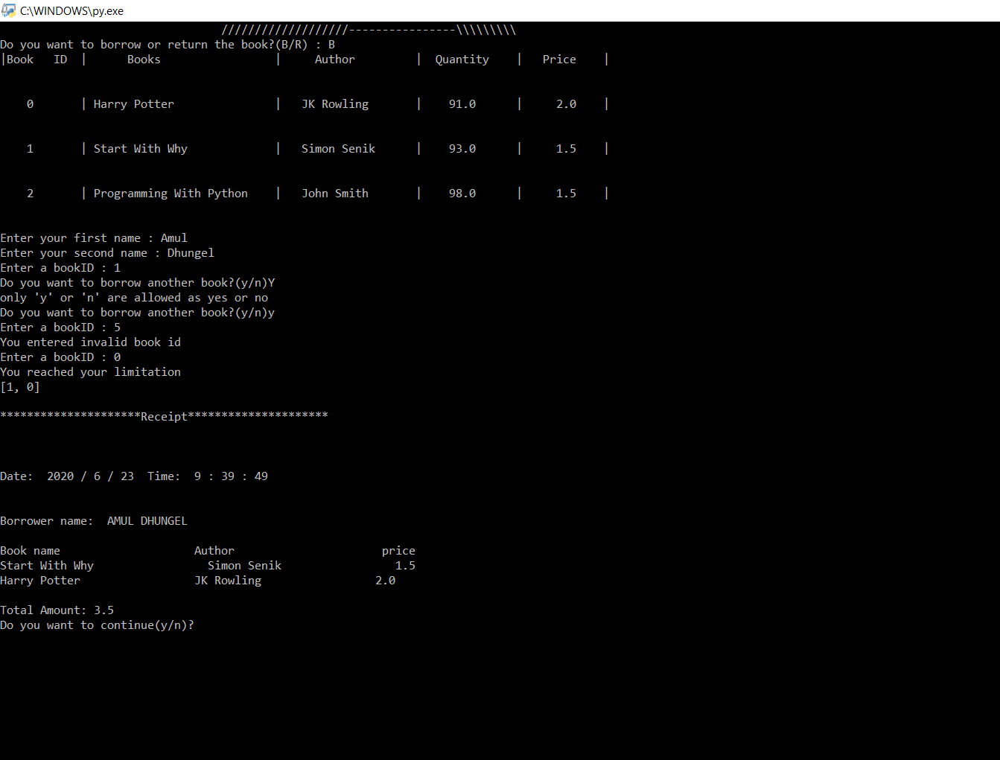

# Library_Management_System

This is the library management system, which records the number of books,price and the name of person
who borrowed the books and the returner. It is an admin based system. It also generated the bill.
